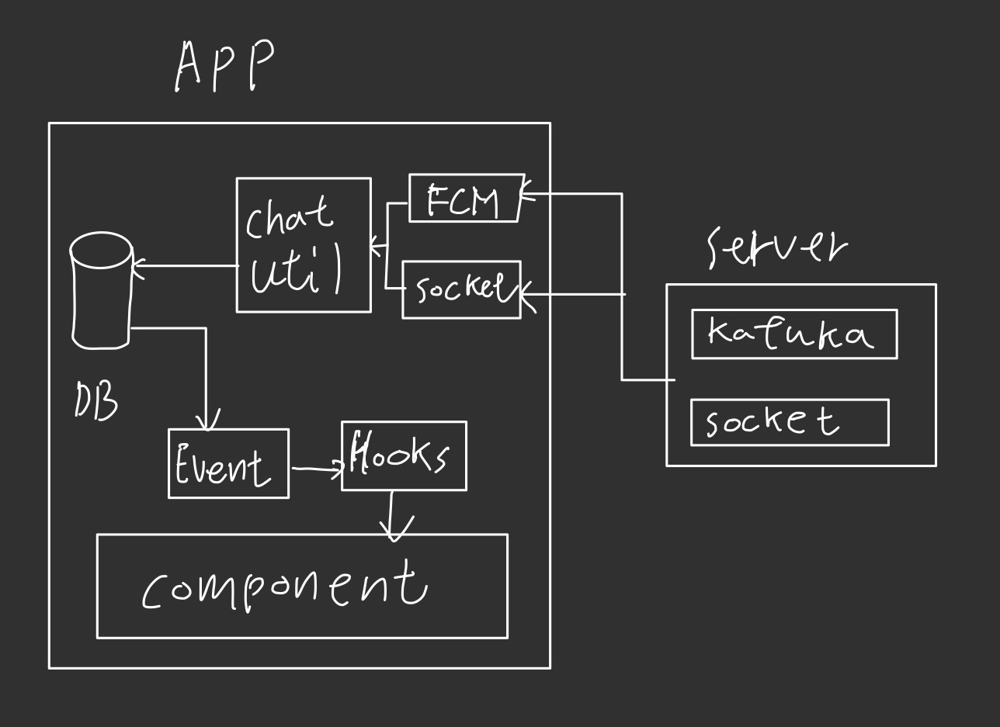

# React Native Local ChatSystem
## 소개
체팅 서비스는 서버 DB의 읽기와 쓰기가 빈번하게 일어나는 만큼 앱 내부의 DB를 사용해서 서버의 비용을 낮추는 설계를 적용한 샘플 프로젝트 입니다.

이론상 서버에서 Kafuka등을 사용하여 안정적인 메시징 시스템이 구축되어있다면 서버에서는 체팅관련 데이터를 DB에 저장하지 않아도 서비스가 가능합니다.(단 사용자가 App 삭제시 데이터는 복구할 수 없습니다.)

## 개요

- React Native 기반의 채팅 앱 프로젝트
- WatermelonDB를 이용한 로컬 DB 관리
- 실시간 채팅을 위한 Socket.IO 클라이언트 연동
- TypeScript로 작성, 구조적이고 유지보수 용이하게 설계
- 주요 기능: 채팅방 생성/수정, 메시지 송수신, 읽음 처리, UI 컴포넌트

## 주요 기술 스택

- React Native
- TypeScript
- WatermelonDB (로컬 DB)
- Socket.IO-client (실시간 통신)
- React Navigation

## 설치 및 실행 방법

1. 저장소 클론
   ```bash
   git clone https://github.com/BGHyeon/react-native-local-chat-system.git
   cd react-native-local-chat-system
   ```

2. 의존성 설치
   ```bash
   npm install
   # or
   yarn install
   ```

3. WatermelonDB 초기화  
   앱 실행 전 또는 최초 실행 시 mock 데이터 초기화
   ```tsx
   import { initMockDataFromJson } from './utils/appInit';

   useEffect(() => {
     initMockDataFromJson();
   }, []);
   ```

4. 앱 실행
   ```bash
   npm run ios
   # or
   npm run android
   ```

## 프로젝트 구조

```
/src
  /components       # UI 컴포넌트 (ChatBubble, ChatRoomContainer 등)
  /hooks            # 커스텀 훅 (useChats, useChatRooms 등)
  /models           # 타입스크립트 모델 및 WatermelonDB 모델
  /database         # WatermelonDB 설정 및 인스턴스
  /utils            # 유틸리티 함수 및 chatUtil 등
  /route           # React Navigation 설정
  /screens          # 화면 컴포넌트 (ChatList, ChatRoom 등)
  /data             # mockData.json
```

## 주요 기능

- **채팅방 관리**: 채팅방 생성, 수정, 삭제, 읽지 않은 메시지 카운트 관리
- **메시지 관리**: 메시지 CRUD, 삭제 처리, 번역 기능 연동 가능
- **실시간 통신**: Socket.IO 연결로 실시간 메시지 송수신 및 이벤트 처리
- **UI/UX**: 메시지 버블, 입력창, 채팅방 리스트 등 모바일 친화적 UI

## 아키택처

- chatUtil을 통해서 채팅방, 메시지 제어
- 벡그라운드 상태이거나 소켓이 연결 상태가 아닐때는 FCM을 통하여 DB 업데이트
- 채팅방에 입장한 상태에서는 소켓의 이벤트를 사용하여 DB 업데이트
- DB가 업데이트 되면 Hook을 사용하여 관련 컴포넌트 자동으로 업데이트
